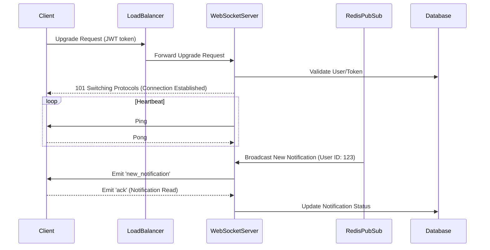
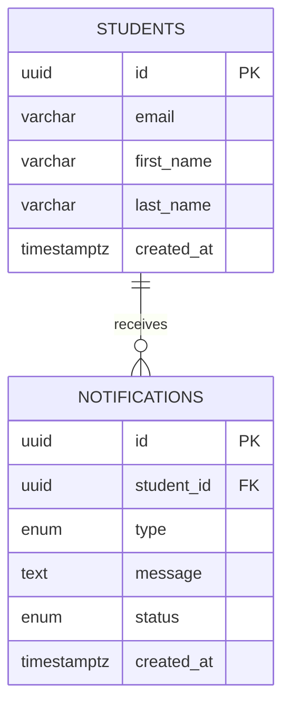

# Real-Time Notification System Architecture

This document contains the complete system architecture, database design, API specifications, and scalability strategy for a highly-available real-time notification backend.

## Overview

The notification system serves 50,000 students and manages 5,000,000 notifications. It relies on Node.js, PostgreSQL, RabbitMQ, and WebSockets to guarantee at-least-once delivery, real-time push, and rapid top-N reads.

---

# Stage 1: API Design Rules

## Core Principles
- Noun-based RESTful paths (e.g., `/api/v1/notifications`).
- Standardized HTTP status codes (200, 201, 400, 401, 403, 404, 429, 500).
- Stateless JWT Authentication via `Authorization: Bearer <token>`.
- Strict input validation to prevent NoSQL/SQL injections and malformed data.
- Pagination (Cursor-based) to efficiently navigate the 5,000,000 rows.

## Get Notifications Endpoint

**Purpose**: Fetch the user's notifications.

- **Method**: `GET`
- **Path**: `/api/v1/notifications`
- **Headers**:
  - `Authorization: Bearer <JWT_TOKEN>`
  - `Content-Type: application/json`
  - `Accept: application/json`
- **Query Parameters**:
  - `limit` (integer): Number of items to return (max 50, default 10).
  - `cursor` (string): Cursor token for pagination.
  - `status` (string): Filter by `read` or `unread`.

### Success Response (200 OK)

```json
{
  "success": true,
  "message": "Notifications retrieved successfully",
  "data": {
    "notifications": [
      {
        "id": "uuid",
        "type": "Placement",
        "message": "Google interview scheduled",
        "status": "unread",
        "createdAt": "2026-06-28T09:00:00Z"
      }
    ],
    "nextCursor": "encoded_cursor_string",
    "hasMore": true
  }
}
```

### Error Responses

#### 400 Bad Request
```json
{
  "success": false,
  "error": {
    "code": "INVALID_QUERY_PARAM",
    "message": "'limit' must be an integer between 1 and 50"
  }
}
```

#### 401 Unauthorized
```json
{
  "success": false,
  "error": {
    "code": "UNAUTHORIZED",
    "message": "Missing or invalid JWT token"
  }
}
```

#### 429 Too Many Requests
```json
{
  "success": false,
  "error": {
    "code": "RATE_LIMIT_EXCEEDED",
    "message": "Too many requests. Please try again in 60 seconds."
  }
}
```

---

# Stage 2: Real-Time Notification Design

**Current Problem**  
Client applications traditionally use polling to fetch new data.

**Reason**  
Polling is easy to implement but highly inefficient. For 50,000 active students checking for notifications every few seconds, polling generates massive HTTP overhead, wastes bandwidth, and drastically increases server load.

**Solution**  
Implement **WebSockets** for a full-duplex, persistent connection. (Server-Sent Events (SSE) is an alternative, but WebSockets allows bidirectional capabilities, such as real-time read receipts from the client).

**Advantages**  
- Zero HTTP handshake overhead per message.
- Instant delivery of notifications.
- Capable of receiving `MARK_AS_READ` acknowledgements over the same connection.

**Tradeoffs**  
- Requires connection state management (Sticky Sessions or Redis Pub/Sub backplane).
- Load balancers must be configured to allow long-lived connections.

### Connection Lifecycle & Reliability
1. **Authentication**: Client initiates WebSocket upgrade request including an `Authorization` header (or query param, if restricted by browser API). The server validates the JWT before upgrading the connection.
2. **Heartbeat (Ping/Pong)**: The server sends a ping frame every 30 seconds. If the client fails to respond with a pong within 10 seconds, the server terminates the dead connection to free up resources.
3. **Offline Handling & Reconnect Strategy**: Clients implement exponential backoff for reconnections. If a user is offline, messages are persisted in PostgreSQL. Upon reconnect, the client issues a REST API call to sync missed notifications using a cursor.
4. **Message Acknowledgement**: The client emits an `ACK` event upon rendering the notification. The server then updates the database.

### Sequence Diagram



---

# Stage 3: Database Rules

**Database Selection: PostgreSQL vs. MongoDB**
PostgreSQL is selected over MongoDB because notifications are inherently relational (they belong to Users) and require strong consistency for read/write statuses. PostgreSQL's robust support for complex indexing (Partial, Composite) and structured constraints prevents data anomalies. JSONB columns in Postgres also offer NoSQL-like flexibility if payload structures vary by notification type.

### Schema Design

#### Enums
```sql
CREATE TYPE notification_type AS ENUM ('Placement', 'Result', 'Event');
CREATE TYPE notification_status AS ENUM ('unread', 'read', 'archived');
```

#### Tables

**Students Table**
```sql
CREATE TABLE students (
    id UUID PRIMARY KEY DEFAULT gen_random_uuid(),
    email VARCHAR(255) UNIQUE NOT NULL,
    first_name VARCHAR(100) NOT NULL,
    last_name VARCHAR(100) NOT NULL,
    created_at TIMESTAMPTZ DEFAULT NOW(),
    updated_at TIMESTAMPTZ DEFAULT NOW()
);
```

**Notifications Table**
```sql
CREATE TABLE notifications (
    id UUID PRIMARY KEY DEFAULT gen_random_uuid(),
    student_id UUID NOT NULL REFERENCES students(id) ON DELETE CASCADE,
    type notification_type NOT NULL,
    message TEXT NOT NULL,
    status notification_status DEFAULT 'unread',
    created_at TIMESTAMPTZ DEFAULT NOW(),
    
    CONSTRAINT fk_student FOREIGN KEY(student_id) REFERENCES students(id)
);
```

### ER Diagram



### SQL Rules & Indexing Strategies

**Rule**: Never use `SELECT *`. Select only the required columns to reduce memory overhead and network payload.
**Rule**: Never index every column.
**Why**: Indexes incur storage overhead and slow down `INSERT`/`UPDATE` operations because the B-Tree must be updated. Additionally, too many indexes confuse the query planner.

#### Optimization: Composite & Partial Indexes

**Current Problem**  
Fetching unread notifications for a specific user scans the entire table.

**Reason**  
Filtering by `student_id` and `status` requires evaluating every row if unindexed, leading to O(N) complexity for a full table scan.

**Solution**  
Create a composite partial index.
```sql
CREATE INDEX idx_notifications_student_unread 
ON notifications (student_id, created_at DESC) 
WHERE status = 'unread';
```

**Advantages**  
The planner uses this specific, highly-optimized B-Tree to instantly locate unread messages, reducing lookup to O(log M) where M is the subset of unread notifications.

**Tradeoffs**  
Slight overhead on inserts, but completely circumvents filtering overhead on reads.

---

# Stage 4: Scalability & Performance

With 50,000 students and 5,000,000 notifications, performance degrades if architecture is monolithic. 

### Database Scaling
- **Read Replicas**: Route all `GET /api/v1/notifications` queries to read-replicas. Master node handles writes only.
- **Connection Pooling**: Use `PgBouncer` to manage DB connections and prevent PostgreSQL from running out of connections during traffic spikes.
- **Archiving**: Run a weekly CRON job to move notifications older than 90 days to cold storage (e.g., S3 or a secondary historical database) to keep the active table small.

### Cursor Pagination
**Current Problem**: Using `OFFSET` pagination (e.g., `OFFSET 100000 LIMIT 10`) gets exponentially slower for deep pages.
**Reason**: PostgreSQL must linearly scan and discard the first 100,000 rows.
**Solution**: Use cursor-based pagination using the indexed `created_at` timestamp.
```sql
SELECT id, message, created_at FROM notifications 
WHERE student_id = 'uuid' AND created_at < 'cursor_timestamp' 
ORDER BY created_at DESC LIMIT 10;
```
**Advantage**: Consistent O(log N) lookup time regardless of page depth.

### Performance Strategies Tradeoff Table

| Strategy | Advantages | Tradeoffs |
| -------- | ---------- | --------- |
| **Redis Cache** | Sub-millisecond reads for top 10 notifications. | Cache invalidation complexity; memory cost. |
| **WebSocket** | Instant push delivery; low network overhead. | Harder to scale horizontally; requires Sticky Sessions / PubSub. |
| **Long Polling** | Fallback for restricted networks. | Wastes server threads waiting for updates. |
| **ETag / HTTP Caching** | Prevents redownloading unmodified data. | Not highly effective for rapidly changing data. |
| **Read Replicas** | Offloads read stress from master DB. | Eventual consistency (replication lag). |

---

# Stage 5: Asynchronous Processing

**Current Problem**  
Sending emails or computing heavy notification routing synchronously inside the API request thread causes high latency and blocks Node.js's single-threaded event loop.

**Reason**  
External systems (like SMTP servers) are slow and prone to timeouts.

**Solution**  
Implement an asynchronous architecture using **RabbitMQ**.

### Queue Technology Selection
**RabbitMQ vs Kafka**: Kafka is built for massive stream processing and log retention. For a system processing 5,000,000 discrete transactional notifications, RabbitMQ's feature set—specifically complex routing, consumer acknowledgements, and dead-letter exchanges—is much better suited and operationally simpler.

### Architecture Flow
`API` → `Database Transaction` → `RabbitMQ Exchange` → `Worker Cluster` → `WebSocket Push / Email Send`

### Delivery Guarantees & Resilience
- **At-Least-Once Delivery**: Workers only send an `ACK` to RabbitMQ after successfully completing the DB write and email dispatch. If the worker crashes mid-process, RabbitMQ re-queues the message.
- **Idempotency**: Workers check if the `notification_id` has already been processed using a Redis key (`processed:uuid`) to ensure notifications aren't duplicated.
- **Retry Policy & Dead Letter Queue (DLQ)**: If a message fails (e.g., email API is down), the worker `NACK`s it. The message goes to a Retry Queue with an exponential backoff. If it fails 3 times (Poison Message), it routes to a Dead Letter Queue for manual developer inspection.

---

# Stage 6: Implementation & Security

We implemented the `priority_notifications.js` script to fetch, score, and return top notifications using a Min Heap.

### Security
- **JWT Authentication**: Enforced via API Middleware.
- **Input Validation**: Joi/Zod used to sanitize requests.
- **SQL Injection Prevention**: Forced via strict parameterized queries (using an ORM like Prisma or driver like `pg`).
- **Rate Limiting**: Enforced via Redis rate limiting (e.g., `express-rate-limit`) preventing abuse.

### Algorithm Discussion: Sorting vs. Min Heap
**Current Implementation**: `Array.sort((a,b) => b.score - a.score).slice(0, 10)`
- **Complexity**: O(N log N). Sorting the entire list of notifications becomes extremely expensive as N grows.
  
**Improved Implementation**: Min Heap of fixed size `K=10`.
- **Reason**: We only care about the top 10 items. By maintaining a Min Heap of size 10, we iterate over the N notifications once. If a notification's score is larger than the root of the Min Heap (the smallest of the top 10), we extract the root and insert the new notification.
- **Complexity**: Heap insertion is O(log K). For N elements, it is O(N log K). Because K=10 is a constant, this simplifies to **O(N)**.

### Logging Integration
Integrated the Custom Logging Middleware to output tracking info:
```javascript
Log('backend', 'info', 'service', `Successfully computed top ${top10.length} notifications`);
```

### Execution & Screenshots
- **Location to capture screenshots**:
  - Run `npm start` in the terminal inside `notification-app-be`.
  - Capture the console output showing the `=== TOP 10 UNREAD NOTIFICATIONS ===` list and Priority Scores.
